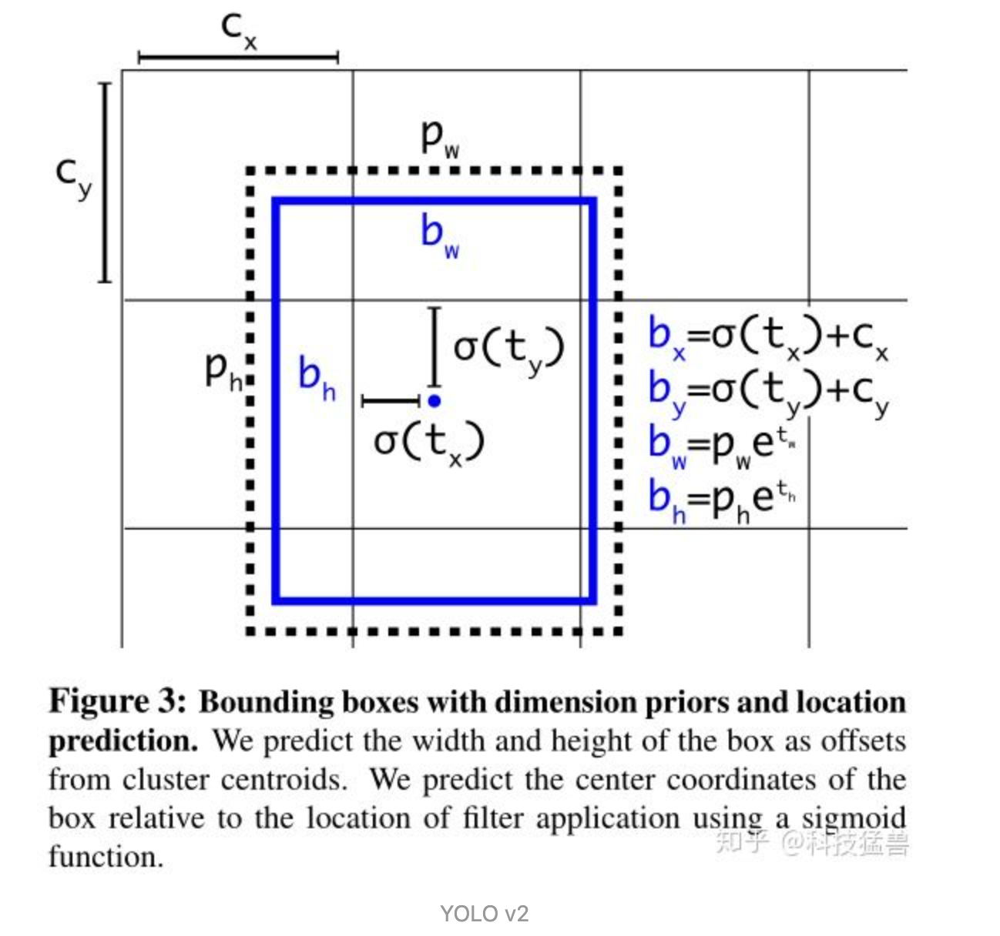
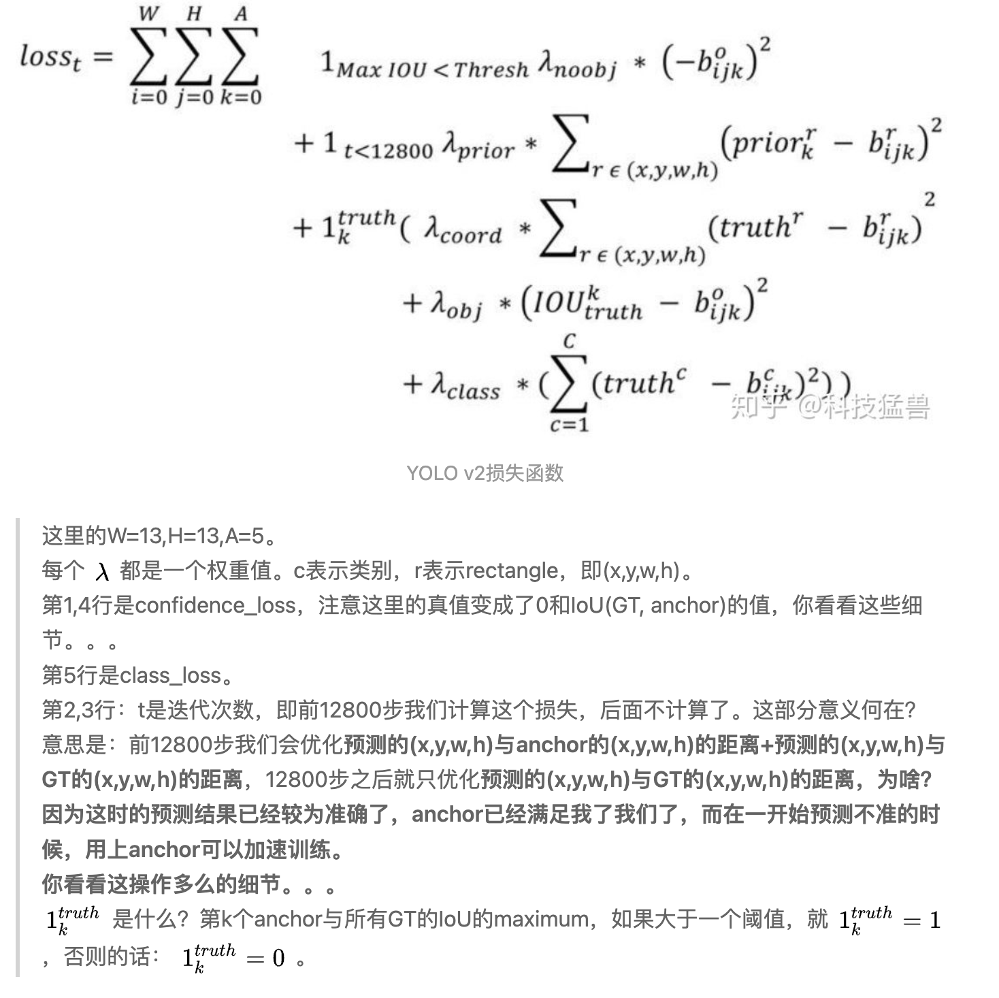
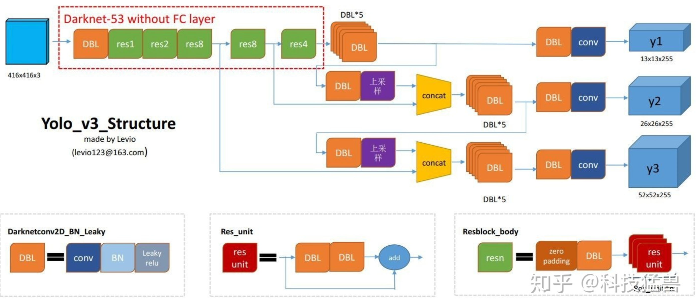
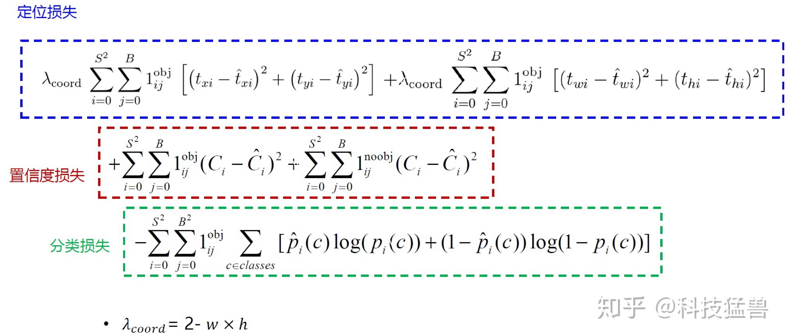

#### YOLO模型思路整理

##### YOLO v1模型思路

对于一张图片进行目标检测可以分为两个步骤：

- 目标位置检测
- 目标分类

一幅图中目标的大小是不同的，所在图片中的位置是不同的，那么直观上的想法就是采用不同大小的滑动窗口的去一个像素一个像素的去遍历图片中的所有位置，然后用分类器去判断滑动窗口中是否包含了检测的目标。但是这样会检测的效率会很低。

所以为了解决效率的问题，同时可以检测出图片中不同大小的目标，YOLOv1就提出了一种将图片按照固定大小分成多个cell，用一个cell中的所有的像素去预测**图像中某个目标对应的目标框的中心点在该cell中的目标**，对应的预测的结果就应该该目标对应的目标框的**x，y，w，h**

这个思路基本上就是YOLOv1模型的雏形了，但是也存在一个问题，如果一个cell中存在两个目标，YOLO v1是无法处理的，之所以无法处理是因为YOLOv1在训练模型的过程中生成label就是一个cell一个目标框，所以就只有一个label。

最终对应的模型一个cell对应的输出的维度是**(c, w, h, x, y, c, w, h, x, y, one-hot)**，这里之所有有两个**(c, w, h, x, y)**是对应一个大目标，一个小目标。

##### YOLO v1的LOSS函数

YOLO v1的LOSS函数对应的只计算了前景的loss。通俗点说就是只计算了label中对应的目标框和模型预测的目标框的之间的参数的差距，如果模型某个cell预测了不存在的目标框，YOLO v1是不考虑计算在内的。

##### YOLO v2模型思路

YOLO v1虽然速度很快，但是很多目标检测不到，同时预测的框也不是很准确。基于这两个问题，YOLO v2就应运而生了，首先是预测不准确的问题，YOLO v2借鉴了R-CNN的思路引入了**anchor**，基于anchor来预测偏移量，从而提高模型的准确度。

之所以是通过引入anchor，让模型变成偏移量的预测，根本的原因在于**偏移量是一个很小的数值，直接预测位置会导致网络在一开始训练不够稳定，使用偏移量可以使训练变得稳定**

然后是YOLO v1很多目标找不到的问题，YOLO v2针对于这个问题将YOLO v1的7*7个区域变成了13\*13个区域，并且每个区域有5个anchor。

##### YOLO v2的损失函数

##### YOLO v3模型思路

YOLO v2在小目标检测上的性能还不是很好，因此YOLO v3引入了多尺度检测头（stride分别为32，16，8），同时在一个stride下对应的grid也均设置了3个anchor。模型的流程如下图所示：

##### YOLO v3损失函数

YOLO v3的损失函数定义如下：

在YOLO v3训练的过程中的正样本是通过计算每个cell中所拥有的3个anchor于图像的真值对应的object box做IOU，当IOU满足一定的阈值并且选择最大的IOU所对应的anchor作为正样本，不满足IOU阈值的anchor作为负样本，即label为0。

总结如下：

- 正样本：与GT的IOU最大的框。
- 负样本：与GT的IOU<0.5 的框。
- 忽略的样本：与GT的IOU>0.5 但不是最大的框。
- 使用 tx 和ty （而不是 bx 和by ）来计算损失。

##### YOLO v4模型思路

- **Using multi-anchors for single ground truth**

  在YOLO v3中正样本是只有1个anchor去负责一个ground truth中的object的框，对应在YOLO v4中只要是anchor同ground truth所计算出的IOU的值满足对应的条件，那么就让anchor负责该ground truth。这样解决了正负样本不均衡的问题。

- **Eliminate grid sensitivity**

  在YOLO v3和v2利用偏移量计算出真正的$b_x，b_y$的时候对应的计算公式如下：
  $$
  b_x = \sigma(t_x)+c_x\\
  b_y = \sigma(t_y)+c_y\\
  b_w=p_we^t_w\\
  b_h=p_he^t_h
  $$
  这里有个问题就是$\sigma(x)$对应的值域的问题，$\sigma(x)$对应的阈值为(0, 1)，即是是无法取到cell所在边界的，那么将$b_x$和$b_y$的计算公式进行改进：
  $$
  b_x = 1.1\cdot\sigma(t_x)+c_x\\
  b_y = 1.1\cdot\sigma(t_t)+c_y
  $$
  这里的**1.1**是一个超参数，这样相当于扩大了$\sigma(x)$的阈值。

##### YOLO v4 LOSS函数

这里的loss函数可以参照https://zhuanlan.zhihu.com/p/183781646相同的章节，就不重复粘贴了。

