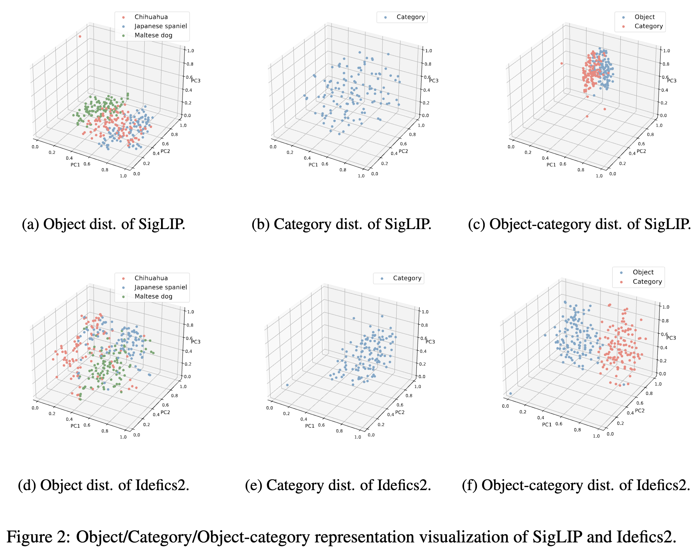
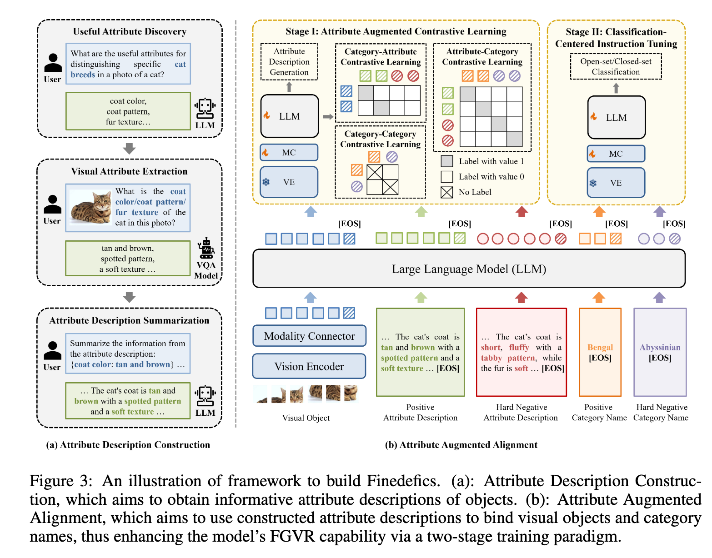

### ANALYZING AND BOOSTING THE POWER OF FINEGRAINED VISUAL RECOGNITION FOR MULTI-MODALLARGE LANGUAGE MODELS

#### Motivation

MLLM still struggle with fine-grained visiual recognition(FGVR), with aims to identify subordinates-level categories from images.

#### Preliminary

The three quintessential capabilities of MLLM:

1. Object information extraction
2. Category knowledge reserve
3. Object-category alignment

They analyzed the representation space of MLLMs and their cosreponding visual language models, the conclusion is that:

1. Object information lost exists berween VLMs and MLLMs but is not the bottleneck.
2. Category knowledge is relative sufficient, but category names cannot fully capture the senmatics.
3. Misalignment between the visual object and category name leads to underperformance.

#### Notions

- Assuming an Image $I_i$ containing an Object $O_i$ is processed by vision encoder $V_\alpha$ and learnable modality connector $F_\beta$ to be transformed into a visual object token sequence of length $m$: $S_o^{i}=[o_1^i, o_2^i, \cdots, o_m^{i}]$.

- Input category name in textual modality $C_i$ is passed through an embedding layer of LLM to obtain the category embedding sequence of length $n$: $S_c^i=[c_1^i, c_2^2, \cdots, c_n^i]$. 

- The object embedding sequence $S_o^{i}$ and category embedding sequence $S_c^i$ are individually passed through LLM Layers $L_\theta$ to obtain the output from the last layers.
  $$
  H_o^i=L_\theta(S^i_o) \\
  H_c^i=L_\theta(S^i_c)
  $$
  Afterward, they select two ways to represent the global semantics of output sequence:

  1. last token embedding
  2. average of the token embedding

#### Analyzed

##### Object Information Extraction

- The output object token from **the vision encoder perserves discriminative information for classification** as shown in Figure2(a).
- Various objects belonging to the same subordinate-level categories can still cluster together and distance each other as shown in Figure2(d).

##### Category Knowledge Reserve

Is the expert knowledge quintessential for FGVR already contained in MLLMs? The author **hypothesize that MLLMs' underperformance in FGVR task stem from the inadequate knowledge of subordinate-level categories.**

Idefics2 exhibits better classification performance than the text encoder of SigLIP, demonstrating its superiority in reserving category knowledge. Despite the rich semantics of the generated category description, the category names have lower discriminability in the representation space of Idefics2 than the text model of SigLIP, illustrated in Figure 2b and 2e.

##### Object-Category Alignment

Since the Idefics2 has an acceptable capability of object information extraction and adequate knowledge of subordinate-level categories. The author hypothesize that the misalignment between the visual object and category name is the root cause.

As shown in Figures 2c and 2f, object and category representations have significant semantic gap. The object cannot match the ground-truth category in the representation space and thus fails to decode into the correct category name

#### Method

- Attribute Description Construction for extracting useful attribute information that can distinguish different categories.
  - Constructing sample-wise attribute descriptions for each FGVR training set、
    - Useful attribute discord by LLMs
    - Visual attribute extraction by VQA models.
    - Attribute description summarization by LLMs 

- Attribute Augmented Alignment dedicated to using constructed attribute descriptions as the intermediate point to bind visual objects and category names in the representation space of LLMs, thus boosting the subsequent Classification-Centered Instruction Tuning.

  - Stage 1: Attribute Augmented Contrastive Learning

    For each object-attribute-category triple $(O_i, A_i, S_i)$, we utilize the vision encoder $V_\alpha$ and the learnable modality connector $F_\beta$ to transfer $O_i$ into an object embedding sequence of length $S_o^i=[o_1^i, o_2^i, \cdots, o^i_m]$ with length $m$. To better capture the global representations, the author pass an [EOS] token through an embedding layer $E_\phi$ of LLM to obtain the vector representation  and append it to the visual embedding sequence $S^i_o$. Therefore, we obtain the newly built object embedding sequence $\widetilde{S}_o^i=[o_1^i, o_2^i, \cdots, o^i_m, o_{EOS}^i]$.

    Similarity, we obtain the attribute embedding sequence $\widetilde{S}_a^i=[a_1^i, a_2^i, \cdots, a_p^i, a_{EOS}^i]$ with length $p+1$ and category embedding sequence $\widetilde{S}==[c_1^i, c_2^i, \cdots, c_p^i, c_{EOS}^i]$ with length $n+1$. Then $\widetilde{S}^i_o, \widetilde{S}^i_a, \widetilde{S}^i_c$ are individually fed into LLM Layer $L_\theta$, and the embeddings of the last predicted token $\hat{o}_{EOS}^i, \hat{a}_{EOS}^i, \hat{c}_{EOS}^i$ are utilized as the global representations of $O_i, A_i, C_i$ respectively.

    To improve the effectiveness of constrastive learning, the authors mine difficult incorrect category names for each example object $O_i$ used in FGVR dataset.

  - Stage 2: Classification-Centered Instruction Tuning.

    In the second stage, the author formulate the FGVR dataset as two kinds of instruction tuning data: open-set QA data and closed-set multiplechoice data. Then we fine-tune the model using this classification-centered instruction tuning data.