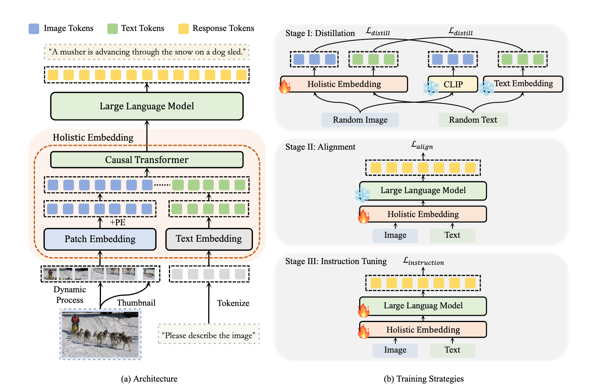

### HoVLE: Unleashing the Power of Monolithic Vision-Language Models with Holistic Vision-Language Embedding

The author propose a new novel monolithic VLM that learn a holistic embedding modlue to expand LLMs with vision capablities. By projecting the vision and languange inputs into a shared embedding space,  HoVLE can understand images without compromising languange proficiency.

##### Motivation

The success of compositional VLMs demonstrates that LLMs are capable of understanding visiual information when image embeddings are properly aligned with text embeddings. So HoVLE build a holistic embedding module.

##### Holistic Embedding Module

Give an Image $I$ and texts $T$, the author transform them into vector forms vis simple tokenization and linear projection:
$$
x_I = PatchEmbed(DynProcss(I)) + PE \\
x_T = TextEmbed(Tokenizer(T))
$$
where DynProcess is the dynamic high-resolution strategy from InternVL. This process divides image into $448 \times 448$ tiles and appends a global thumbnail to provide overall context. PatchEmbed refers to a patch embedding layer with stride $s$ and converts the image tiles into a sequence $x_I$ of $n_I$ images tokens with dimensions $c$. PE is learnable position embedding. Tokenizer converts raw texts into token indices and TextEmbed is a word embedding layer with vocabulary size of $v$ and dimensions of $c$.

Afterward, these image tokens and text tokens are combined  as the input tokens. The holistic embedding module utilizes a stack of causal Transformer layers to project these token to a shared embedding space.
$$
\hat{x}=CausalTransformer(x)
$$

##### Training Procedure

The first stage trains holistic embedding to distill image feature from a pre-trained visual encoder and the text embedding from an LLM.

The second stage combines the holistic embedding module with the LLM to perform auto-regressive training align different modalities to a shared embedding space.

*Distillation Stage* This stage aims to provide basic vision and language encoding abilities with the holistic embedding. The author extract image and text embeddings from the holistic embedding output. A pre-trained visual encoder and LLM embedding layer are utilized to compute the target image feature $z_I$ and text feature $z_T$
$$
min_{\theta_{Embed}}L_{distill}(\hat{x}_I,z_I;\theta_{Embed}) + min_{\theta_{Embed}}L_{distill}(\hat{x}_T,z_T;\theta_{Embed})
$$
where $L_{distill}$ is the negative cosine similarity between two features.

