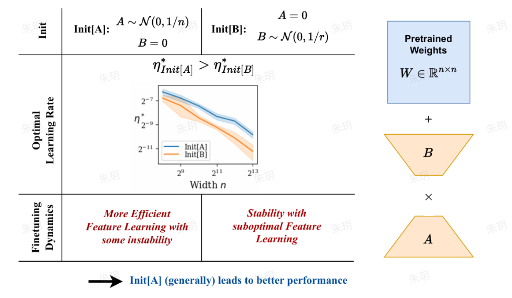

### **LoRA and Related Works**

LoRA is a parameter-efficient fine-tuning method that adapts the pre-trained models using low-rank matrix decomposition, significantly reducing the number of trainable parameters while maintaining performance.

##### The initialization of LoRA

The downsample matrix $A$ is initialized using a Gaussian distribution, while the upsample matrix $B$ is initialized with zeros.

- Why the upsample matrix is initialized by zeros?

  - By initializing the upsample matrix $B$ with zeros, the weight update $\Delta{W}=A \cdot B$ is initially zero. This ensures that at the start of fine-tuning, the model remains identical to the original pre-trained model, avoiding any abrupt changes to its parameters. However, the gradient of $B$ will not be zero. This is because the gradient of $B$ depends on the loss function and $A$.
    $$
    \frac{\partial{L}}{\partial{B}} = A^T \cdot \frac{\partial{L}}{\part{\Delta{W}}}
    $$

- Why can't  the downsample matrix $A$ be initialized with zeros?

  - If the downsample matrix $A$ is initialized with zeros, the gradient of $A$ will be zero.
    $$
    \frac{\partial{L}}{\partial{A}} = \frac{\partial{L}}{\partial{\Delta{W}}} \cdot B^T 
    $$

In fact, the explanation applies equally if $A$ and $B$ are swapped, so it does not explain why this design choice was made.

**The impact of initialization on LoRA Finetuning Dynamics** is empirically analyzed and concluded through experiments.

- The initialization of $A$ enhances feature learning efficiency but leads to an unstable training process.
- The initialization of $B$ ensure stable training but does not achieve optimal feature learning.

 

##### VeRA(Vector-based Random Matrix Adaption)

VeRA propose a method which could significantly decrease the parameter of LoRA. Instead of initializing $A$ and $B$ fpr each layer,  the authors introduced a shared low-rank matrix across the layers. Additionally, they introduce two trainale parameters $b$ and $d$.

##### DoRA

The authors decompose the original model weights into two matrices: one representing the magnitude of and the other capturing the directional information.